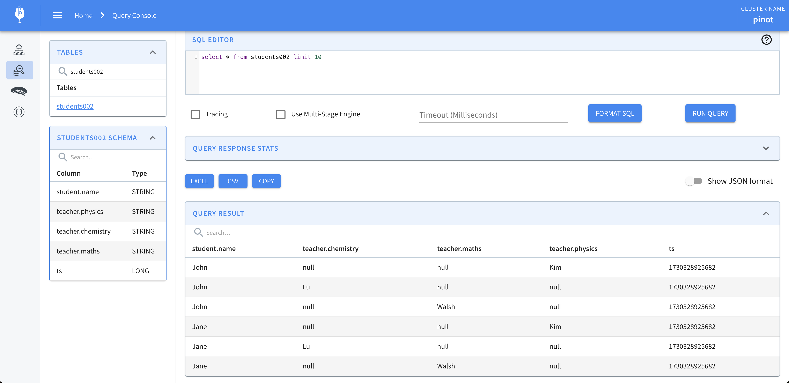
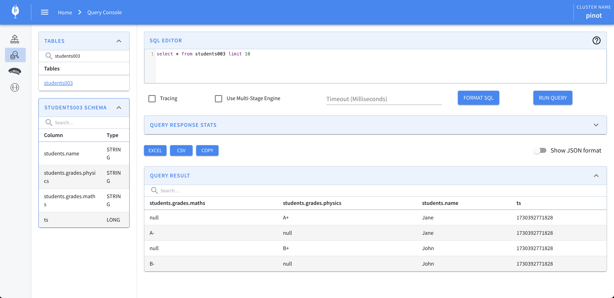
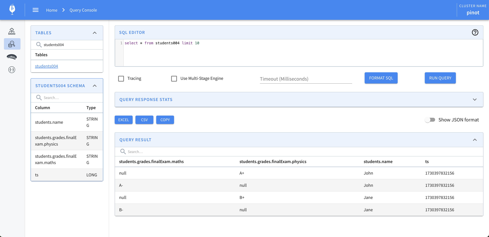
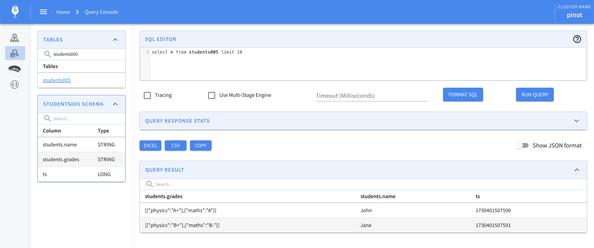
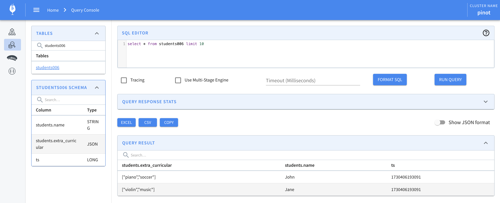

Additional examples that demonstrate handling of complex types.

# Unnest Root Level Collection
In this example, we would look at un-nesting json records that are batched together as part of a single key at the root 
level. We will make use of the [ComplexType](complex-type.md) configs to persist the individual student records as 
separate rows in Pinot.

## Sample JSON record
```json
{
  "students": [
    {
      "firstName": "Jane",
      "id": "100",
      "scores": {
        "physics": 91,
        "chemistry": 93,
        "maths": 99
      }
    },
    {
      "firstName": "John",
      "id": "101",
      "scores": {
        "physics": 97,
        "chemistry": 98,
        "maths": 99
      }
    },
    {
      "firstName": "Jen",
      "id": "102",
      "scores": {
        "physics": 96,
        "chemistry": 95,
        "maths": 100
      }
    }
  ]
}
```


## Pinot Schema
The Pinot schema for this example would look as follows.

```json
{
  "schemaName": "students001",
  "enableColumnBasedNullHandling": false,
  "dimensionFieldSpecs": [
    {
      "name": "students.firstName",
      "dataType": "STRING",
      "notNull": false,
      "fieldType": "DIMENSION"
    },
    {
      "name": "students.id",
      "dataType": "STRING",
      "notNull": false,
      "fieldType": "DIMENSION"
    },
    {
      "name": "students.scores",
      "dataType": "JSON",
      "notNull": false,
      "fieldType": "DIMENSION"
    }
  ],
  "dateTimeFieldSpecs": [
    {
      "name": "ts",
      "fieldType": "DATE_TIME",
      "dataType": "LONG",
      "format": "1:MILLISECONDS:EPOCH",
      "granularity": "1:MILLISECONDS"
    }
  ],
  "metricFieldSpecs": []
}
```

## Pinot Table Configuration

The Pinot table configuration for this schema would look as follows.

```json
{
    "ingestionConfig": {
      "complexTypeConfig": {
        "fieldsToUnnest": [
          "students"
        ]
      }
  }
}
```

## Data in Pinot

Post ingestion, the student records would appear as separate records in Pinot. Note that the nested field `scores` is
captured as a JSON field.


# Unnest sibling collections

In this example, we would look at un-nesting the sibling collections "student" and "teacher".

## Sample JSON Record

```json
{
  "student": [
    {
      "name": "John"
    },
    {
      "name": "Jane"
    }
  ],
  "teacher": [
    {
      "physics": "Kim"
    },
    {
      "chemistry": "Lu"
    },
    {
      "maths": "Walsh"
    }
  ]
}
```

## Pinot Schema

```json
{
  "schemaName": "students002",
  "enableColumnBasedNullHandling": false,
  "dimensionFieldSpecs": [
    {
      "name": "student.name",
      "dataType": "STRING",
      "fieldType": "DIMENSION",
      "notNull": false
    },
    {
      "name": "teacher.physics",
      "dataType": "STRING",
      "fieldType": "DIMENSION",
      "notNull": false
    },
    {
      "name": "teacher.chemistry",
      "dataType": "STRING",
      "fieldType": "DIMENSION",
      "notNull": false
    },
    {
      "name": "teacher.maths",
      "dataType": "STRING",
      "fieldType": "DIMENSION",
      "notNull": false
    }
  ]
}
```

## Pinot Table configuration

```json
  "complexTypeConfig": {
    "fieldsToUnnest": [
      "student",
      "teacher"
    ]
  }
```

## Data in Pinot



# Unnest nested collection

In this example, we would look at un-nesting the nested collection "students.grades".

## Sample JSON Record

```json
{
  "students": [
    {
      "name": "Jane",
      "grades": [
        {
          "physics": "A+"
        },
        {
          "maths": "A-"
        }
      ]
    },
    {
      "name": "John",
      "grades": [
        {
          "physics": "B+"
        },
        {
          "maths": "B-"
        }
      ]
    }
  ]
}
```

## Pinot Schema

```json
{
  "schemaName": "students003",
  "enableColumnBasedNullHandling": false,
  "dimensionFieldSpecs": [
    {
      "name": "students.name",
      "dataType": "STRING",
      "fieldType": "DIMENSION",
      "notNull": false
    },
    {
      "name": "students.grades.physics",
      "dataType": "STRING",
      "fieldType": "DIMENSION",
      "notNull": false
    },
    {
      "name": "students.grades.maths",
      "dataType": "STRING",
      "fieldType": "DIMENSION",
      "notNull": false
    }
  ]
}
```

## Pinot Table configuration

```json
  "complexTypeConfig": {
    "fieldsToUnnest": [
      "students",
      "students.grades"
    ]
  }
```

## Data in Pinot


# Unnest Multi Level Array

In this example, we would look at un-nesting the array "finalExam" which is located within the array "students".

## Sample JSON Record

```json
{
  "students": [
    {
      "name": "John",
      "grades": {
        "finalExam": [
          {
            "physics": "A+"
          },
          {
            "maths": "A-"
          }
        ]
      }
    },
    {
      "name": "Jane",
      "grades": {
        "finalExam": [
          {
            "physics": "B+"
          },
          {
            "maths": "B-"
          }
        ]
      }
    }
  ]
}
```

## Pinot Schema

```json
{
    "schemaName": "students004",
    "enableColumnBasedNullHandling": false,
    "dimensionFieldSpecs": [
      {
        "name": "students.name",
        "dataType": "STRING",
        "notNull": false,
        "fieldType": "DIMENSION"
      },
      {
        "name": "students.grades.finalExam.physics",
        "dataType": "STRING",
        "notNull": false,
        "fieldType": "DIMENSION"
      },
      {
        "name": "students.grades.finalExam.maths",
        "dataType": "STRING",
        "notNull": false,
        "fieldType": "DIMENSION"
      }
    ]
  }
```

## Pinot Table configuration

```json
  "complexTypeConfig": {
    "fieldsToUnnest": [
      "students",
      "students.grades.finalExam"
    ]
  }
```

## Data in Pinot



# Convert inner collections

In this example, the inner collection "grades" is converted into a multi value string column.

## Sample JSON Record

```json
{
  "students": [
    {
      "name": "John",
      "grades": [
        {
          "physics": "A+"
        },
        {
          "maths": "A"
        }
      ]
    },
    {
      "name": "Jane",
      "grades": [
        {
          "physics": "B+"
        },
        {
          "maths": "B-"
        }
      ]
    }
  ]
}
```

## Pinot Schema

```json
{
    "schemaName": "students005",
    "enableColumnBasedNullHandling": false,
    "dimensionFieldSpecs": [
      {
        "name": "students.name",
        "dataType": "STRING",
        "notNull": false,
        "fieldType": "DIMENSION"
      },
      {
        "name": "students.grades",
        "dataType": "STRING",
        "notNull": false,
        "isSingleValue": false,
        "fieldType": "DIMENSION"
      }
    ]
  }
```

## Pinot Table configuration

```json
  "complexTypeConfig": {
    "fieldsToUnnest": [
      "students"
    ]
  }
```

## Data in Pinot




# Primitive Array Converted to JSON String

In this example, the array of primitives "extra_curricular" is converted to a Json string.

## Sample JSON Record

```json
{
  "students": [
    {
      "name": "John",
      "extra_curricular": [
        "piano", "soccer"
      ]
    },
    {
      "name": "Jane",
      "extra_curricular": [
        "violin", "music"
      ]
    }
  ]
}
```

## Pinot Schema

```json
{
    "schemaName": "students006",
    "enableColumnBasedNullHandling": false,
    "dimensionFieldSpecs": [
      {
        "name": "students.name",
        "dataType": "STRING",
        "notNull": false,
        "fieldType": "DIMENSION"
      },
      {
        "name": "students.extra_curricular",
        "dataType": "JSON",
        "notNull": false,
        "fieldType": "DIMENSION"
      }
    ]
  }
```

## Pinot Table configuration

```json
    "complexTypeConfig": {
      "fieldsToUnnest": [
        "students"
      ], 
      "collectionNotUnnestedToJson": "ALL"
    }
```

## Data in Pinot


