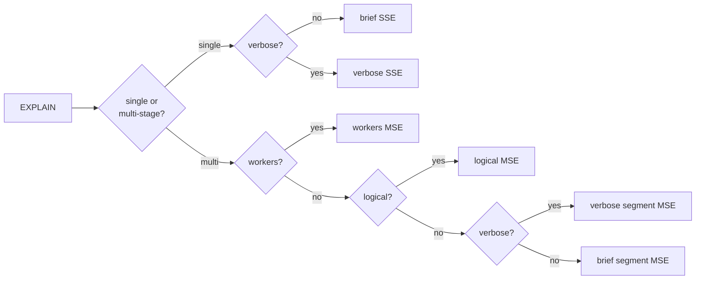

# Explain plan

Query execution within Pinot is modeled as a sequence of operators that are executed in a pipelined manner to produce the final result. The `EXPLAIN PLAN FOR` syntax can be used to obtain the execution plan of a query, which can be useful to further optimize them.


The explain plan is a feature that is still under development and may change in future releases. Pinot explain plans are human-readable and are intended to be used for debugging and optimization purposes. This is specially important when using the explain plan in automated scripts or tools. The explain plan, even the ones returned as tables or JSON, are not guaranteed to be stable across releases.


Pinot supports different type of explain plans depending on the query engine and the granularity or details we want to obtain.



## Different plans for different segments <a href="#different-plans-for-different-segments" id="different-plans-for-different-segments"></a>

Segments are the basic unit of data storage and processing in Pinot. When a query is executed, it is executed on each segment and the results are merged together. Not all segments have the data distribution, indexes, etc. Therefore the query engine may decide to execute the query differently on different segments. This includes:

* Segments that were not refreshed since indexes were added or removed on the table config.
* Realtime segments that are being ingested, where some indexes (like range indexes) cannot be used.
* Data distribution, specially min and max values for columns, which can affect the query plan.

Given a Pinot query can touch thousands of segments, Pinot tries to minimize the number of [different queries](#user-content-fn-1)[^1] shown when explaining a query. By default, Pinot tries to analyze the plan for each segment and returns a simplified plan. How this simplification is done depends on the query engine, you can read more about that below.

There is a verbose mode that can be used to show the plan for each segment. This mode is activated by setting the `explainPlanVerbose` query option to true, prefixing `SET explainPlanVerbose=true;` to the explain plan sentence.

## Explain on multi-stage query engine

Following the more complex nature of the multi-stage query engine, its explain plan can be customized to get a plan specialized[^2] on different aspects of the query execution.

There are 3 different types of explain plans for the multi-stage query engine:

| Mode         | Syntax by default                         | Syntax if segment plan is enabled                               | Description                                                                                                                                    |
| ------------ | ----------------------------------------- | --------------------------------------------------------------- | ---------------------------------------------------------------------------------------------------------------------------------------------- |
| Segment plan | Cannot be used                            | `EXPLAIN PLAN FOR`                                              | Includes the segment specific information (like indexes). Have to be enabled with query options or broker configuration.                       |
| Logical plan | `EXPLAIN PLAN WITHOUT IMPLEMENTATION FOR` | `EXPLAIN PLAN FOR` or `EXPLAIN PLAN WITHOUT IMPLEMENTATION FOR` | Simplest multi-stage plan. No index or data shuffle information.                                                                               |
| Workers plan | `EXPLAIN IMPLEMENTATION PLAN FOR`         | `EXPLAIN IMPLEMENTATION PLAN FOR`                               | <p>Used to understand data shuffle between servers.<br><br>Note: The name of this mode is open to discussion and may change in the future.</p> |



The syntax used to select each explain plan mode is confusing and it may be changed in the future.


### Segment plan <a href="#segment-plan" id="segment-plan"></a>

The plan with segments is a detailed representation of the query execution plan that includes the segment specific information, like data distribution, indexes, etc.

This mode was introduced in Pinot 1.3.0 and it is planned to be the default in future releases. Meanwhile it can be used by setting the `explainAskingServers` query option to true, prefixing `SET explainAskingServers=true;` to the explain plan sentence. Alternatively this mode can be activated by default by changing the broker configuration `pinot.query.multistage.explain.include.segment.plan` to true.

Independently of how it is activated, once this mode is enabled, `EXPLAIN PLAN FOR` syntax will include segment information.

#### Verbose and brief mode

As explained in `Different plans for different segments`, by default Pinot tries to minimize the number of [different query](#user-content-fn-3)[^3] shown when explaining a query. In multi-stage, the brief mode includes all different plans, but each equivalent plan is aggregated. For example, if the same plan is executed on 100 segments, the brief mode will show it only once and stats like the number of docs will be summed.

In the verbose mode, one plan is shown per segment, including the segment name and all the segment specific information. This may be useful to know which segments are not using indexes, or which segments are using a different data distribution.

#### Example

```sql
-- SET explainAskingServer= true is required if 
-- pinot.query.multistage.explain.include.segment.plan is false, 
-- optional otherise
SET explainAskingServers=true;
EXPLAIN PLAN FOR
SELECT DISTINCT deviceOS, groupUUID
FROM userAttributes AS a
JOIN userGroups AS g
ON a.userUUID = g.userUUID
WHERE g.groupUUID = 'group-1'
LIMIT 100
```

Returns

```
Execution Plan
LogicalSort(offset=[0], fetch=[100])
  PinotLogicalSortExchange(distribution=[hash], collation=[[]], isSortOnSender=[false], isSortOnReceiver=[false])
    LogicalSort(fetch=[100])
      PinotLogicalAggregate(group=[{0, 1}])
        PinotLogicalExchange(distribution=[hash[0, 1]])
          PinotLogicalAggregate(group=[{0, 2}])
            LogicalJoin(condition=[=($1, $3)], joinType=[inner])
              PinotLogicalExchange(distribution=[hash[1]])
                LeafStageCombineOperator(table=[userAttributes])
                  StreamingInstanceResponse
                    StreamingCombineSelect
                      SelectStreaming(table=[userAttributes], totalDocs=[10000])
                        Project(columns=[[deviceOS, userUUID]])
                          DocIdSet(maxDocs=[40000])
                            FilterMatchEntireSegment(numDocs=[10000])
              PinotLogicalExchange(distribution=[hash[1]])
                LeafStageCombineOperator(table=[userGroups])
                  StreamingInstanceResponse
                    StreamingCombineSelect
                      SelectStreaming(table=[userGroups], totalDocs=[2478])
                        Project(columns=[[groupUUID, userUUID]])
                          DocIdSet(maxDocs=[50000])
                            FilterInvertedIndex(predicate=[groupUUID = 'group-1'], indexLookUp=[inverted_index], operator=[EQ])
                      SelectStreaming(segment=[userGroups_OFFLINE_4], table=[userGroups], totalDocs=[4])
                        Project(columns=[[groupUUID, userUUID]])
                          DocIdSet(maxDocs=[10000])
                            FilterEmpty
                      SelectStreaming(segment=[userGroups_OFFLINE_6], table=[userGroups], totalDocs=[4])
                        Project(columns=[[groupUUID, userUUID]])
                          DocIdSet(maxDocs=[10000])
                            FilterMatchEntireSegment(numDocs=[4])
```

### Logical Plan

The logical plan is a high-level representation of the query execution plan. This plan is calculated on the broker without asking the servers for their segment specific plans. This means that the logical plan does not include the segment specific information, like data distribution, indexes, etc.

In Pinot 1.3.0, the logical plan is enabled by default and can be obtained by using `EXPLAIN PLAN FOR` syntax. Optionally, the segment plan can be enabled by default, in which case the logical plan can be obtained by using `EXPLAIN PLAN WITHOUT IMPLEMENTATION FOR` syntax.


The recommended way to ask for logical plan is to use `EXPLAIN PLAN WITHOUT IMPLEMENTATION FOR` given this syntax is available in all versions of Pinot, independently of the configuration.


#### Example:

```sql
-- WITHOUT IMPLENTATION qualifier can be used to ensure logical plan is used
-- It can be used in any version of Pinot even when segment plan is enabled by default
EXPLAIN PLAN WITHOUT IMPLEMENTATION FOR 
SELECT DISTINCT deviceOS, groupUUID
FROM userAttributes AS a
JOIN userGroups AS g
ON a.userUUID = g.userUUID
WHERE g.groupUUID = 'group-1'
LIMIT 100
```

Returns:

```
Execution Plan
LogicalSort(offset=[0], fetch=[100])
  PinotLogicalSortExchange(distribution=[hash], collation=[[]], isSortOnSender=[false], isSortOnReceiver=[false])
    LogicalSort(fetch=[100])
      PinotLogicalAggregate(group=[{0, 1}])
        PinotLogicalExchange(distribution=[hash[0, 1]])
          PinotLogicalAggregate(group=[{0, 2}])
            LogicalJoin(condition=[=($1, $3)], joinType=[inner])
              PinotLogicalExchange(distribution=[hash[1]])
                LogicalProject(deviceOS=[$4], userUUID=[$6])
                  LogicalTableScan(table=[[default, userAttributes]])
              PinotLogicalExchange(distribution=[hash[1]])
                LogicalProject(groupUUID=[$3], userUUID=[$4])
                  LogicalFilter(condition=[=($3, _UTF-8'group-1')])
                    LogicalTableScan(table=[[default, userGroups]])
```

### Workers plan


There have been some discussion about how to name this explain mode and it may change in future versions. The term _worker_ is leaking an implementation detail that is not explained anywhere else in the user documentation.


The workers plan is a detailed representation of the query execution plan that includes information on how the query is distributed among different servers and workers inside them. This plan does not include the segment specific information, like data distribution, indexes, etc. and it is probably the less[^4] useful of the plans for normal use cases.

Their main use case is to try to reduce data shuffling between workers by verifying that, for example, a join is executed in colocated fashion.

#### Example

```sql
EXPLAIN IMPLEMENTATION PLAN FOR
SELECT DISTINCT deviceOS, groupUUID
FROM userAttributes AS a
JOIN userGroups AS g
ON a.userUUID = g.userUUID
WHERE g.groupUUID = 'group-1'
LIMIT 100
```

Returns:

```
0]@192.168.0.98:54196|[0] MAIL_RECEIVE(BROADCAST_DISTRIBUTED)
├── [1]@192.168.0.98:54227|[3] MAIL_SEND(BROADCAST_DISTRIBUTED)->{[0]@192.168.0.98:54196|[0]} (Subtree Omitted)
├── [1]@192.168.0.98:54220|[2] MAIL_SEND(BROADCAST_DISTRIBUTED)->{[0]@192.168.0.98:54196|[0]} (Subtree Omitted)
├── [1]@192.168.0.98:54214|[1] MAIL_SEND(BROADCAST_DISTRIBUTED)->{[0]@192.168.0.98:54196|[0]} (Subtree Omitted)
└── [1]@192.168.0.98:54206|[0] MAIL_SEND(BROADCAST_DISTRIBUTED)->{[0]@192.168.0.98:54196|[0]}
    └── [1]@192.168.0.98:54206|[0] SORT LIMIT 100
        └── [1]@192.168.0.98:54206|[0] MAIL_RECEIVE(HASH_DISTRIBUTED)
            ├── [2]@192.168.0.98:54227|[3] MAIL_SEND(HASH_DISTRIBUTED)->{[1]@192.168.0.98:54207|[0],[1]@192.168.0.98:54215|[1],[1]@192.168.0.98:54221|[2],[1]@192.168.0.98:54228|[3]} (Subtree Omitted)
            ├── [2]@192.168.0.98:54220|[2] MAIL_SEND(HASH_DISTRIBUTED)->{[1]@192.168.0.98:54207|[0],[1]@192.168.0.98:54215|[1],[1]@192.168.0.98:54221|[2],[1]@192.168.0.98:54228|[3]} (Subtree Omitted)
            ├── [2]@192.168.0.98:54214|[1] MAIL_SEND(HASH_DISTRIBUTED)->{[1]@192.168.0.98:54207|[0],[1]@192.168.0.98:54215|[1],[1]@192.168.0.98:54221|[2],[1]@192.168.0.98:54228|[3]} (Subtree Omitted)
            └── [2]@192.168.0.98:54206|[0] MAIL_SEND(HASH_DISTRIBUTED)->{[1]@192.168.0.98:54207|[0],[1]@192.168.0.98:54215|[1],[1]@192.168.0.98:54221|[2],[1]@192.168.0.98:54228|[3]}
                └── [2]@192.168.0.98:54206|[0] SORT LIMIT 100
                    └── [2]@192.168.0.98:54206|[0] AGGREGATE_FINAL
                        └── [2]@192.168.0.98:54206|[0] MAIL_RECEIVE(HASH_DISTRIBUTED)
                            ├── [3]@192.168.0.98:54227|[3] MAIL_SEND(HASH_DISTRIBUTED)->{[2]@192.168.0.98:54207|[0],[2]@192.168.0.98:54215|[1],[2]@192.168.0.98:54221|[2],[2]@192.168.0.98:54228|[3]} (Subtree Omitted)
                            ├── [3]@192.168.0.98:54220|[2] MAIL_SEND(HASH_DISTRIBUTED)->{[2]@192.168.0.98:54207|[0],[2]@192.168.0.98:54215|[1],[2]@192.168.0.98:54221|[2],[2]@192.168.0.98:54228|[3]} (Subtree Omitted)
                            ├── [3]@192.168.0.98:54214|[1] MAIL_SEND(HASH_DISTRIBUTED)->{[2]@192.168.0.98:54207|[0],[2]@192.168.0.98:54215|[1],[2]@192.168.0.98:54221|[2],[2]@192.168.0.98:54228|[3]} (Subtree Omitted)
                            └── [3]@192.168.0.98:54206|[0] MAIL_SEND(HASH_DISTRIBUTED)->{[2]@192.168.0.98:54207|[0],[2]@192.168.0.98:54215|[1],[2]@192.168.0.98:54221|[2],[2]@192.168.0.98:54228|[3]}
                                └── [3]@192.168.0.98:54206|[0] AGGREGATE_LEAF
                                    └── [3]@192.168.0.98:54206|[0] JOIN
                                        ├── [3]@192.168.0.98:54206|[0] MAIL_RECEIVE(HASH_DISTRIBUTED)
                                        │   ├── [4]@192.168.0.98:54227|[1] MAIL_SEND(HASH_DISTRIBUTED)->{[3]@192.168.0.98:54207|[0],[3]@192.168.0.98:54215|[1],[3]@192.168.0.98:54221|[2],[3]@192.168.0.98:54228|[3]} (Subtree Omitted)
                                        │   └── [4]@192.168.0.98:54214|[0] MAIL_SEND(HASH_DISTRIBUTED)->{[3]@192.168.0.98:54207|[0],[3]@192.168.0.98:54215|[1],[3]@192.168.0.98:54221|[2],[3]@192.168.0.98:54228|[3]}
                                        │       └── [4]@192.168.0.98:54214|[0] PROJECT
                                        │           └── [4]@192.168.0.98:54214|[0] TABLE SCAN (userAttributes) null
                                        └── [3]@192.168.0.98:54206|[0] MAIL_RECEIVE(HASH_DISTRIBUTED)
                                            ├── [5]@192.168.0.98:54227|[1] MAIL_SEND(HASH_DISTRIBUTED)->{[3]@192.168.0.98:54207|[0],[3]@192.168.0.98:54215|[1],[3]@192.168.0.98:54221|[2],[3]@192.168.0.98:54228|[3]} (Subtree Omitted)
                                            └── [5]@192.168.0.98:54214|[0] MAIL_SEND(HASH_DISTRIBUTED)->{[3]@192.168.0.98:54207|[0],[3]@192.168.0.98:54215|[1],[3]@192.168.0.98:54221|[2],[3]@192.168.0.98:54228|[3]}
                                                └── [5]@192.168.0.98:54214|[0] PROJECT
                                                    └── [5]@192.168.0.98:54214|[0] FILTER
                                                        └── [5]@192.168.0.98:54214|[0] TABLE SCAN (userGroups) null
```

## Explain on single stage query engine


Explain plan for single stage query engine is described in deep in [explain-plan.md](explain-plan.md "mention")


Explain plan for single stage query engine is simpler and less customized, but returns the information in a tabular format. For example, the query `EXPLAIN PLAN FOR SELECT playerID, playerName FROM baseballStats`.&#x20;

\
Returns the following table:

```
+---------------------------------------------|------------|---------|
| Operator                                    | Operator_Id|Parent_Id|
+---------------------------------------------|------------|---------|
|BROKER_REDUCE(limit:10)                      | 1          | 0       |
|COMBINE_SELECT                               | 2          | 1       |
|PLAN_START(numSegmentsForThisPlan:1)         | -1         | -1      |
|SELECT(selectList:playerID, playerName)      | 3          | 2       |
|TRANSFORM_PASSTHROUGH(playerID, playerName)  | 4          | 3       |
|PROJECT(playerName, playerID)                | 5          | 4       |
|DOC_ID_SET                                   | 6          | 5       |
|FILTER_MATCH_ENTIRE_SEGMENT(docs:97889)      | 7          | 6       |
+---------------------------------------------|------------|---------|
```

Where `Operator` column describes the operator that Pinot will run whereas the `Operator_Id` and `Parent_Id` columns show the parent-child relationship between operators, which forms the execution tree. For example, the plan above should be understood as:

```
BROKER_REDUCE(limit:10)
└── COMBINE_SELECT
    └── PLAN_START(numSegmentsForThisPlan:1)
        └── SELECT(selectList:playerID, playerName)
            └── TRANSFORM_PASSTHROUGH(playerID, playerName)
                └── PROJECT(playerName, playerID)
                    └── DOC_ID_SET
                        └── FILTER_MATCH_ENTIRE_SEGMENT(docs:97889)
```

\


[^1]: 'different query plans' ?

[^2]: focused?

[^3]: different plans?

[^4]: least?
